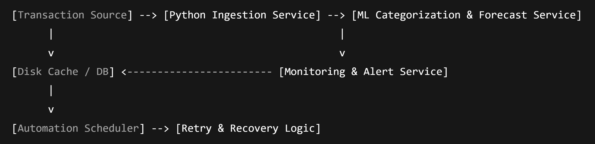
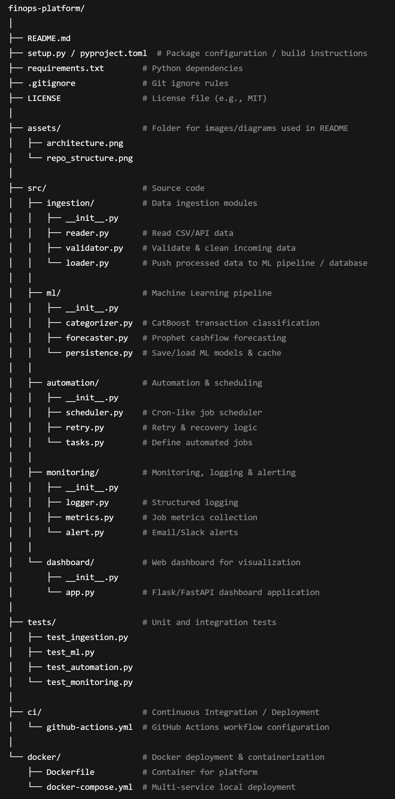

## FinOpsia

**Python-based Financial Operations Automation & Reliability Platform**

---

## Project Goal

FinOpsia is a Python-based financial operations platform that **ingests transaction data from external sources**, validates and persists it, and then applies **analytics, machine learning, and automation** to support financial decision-making for SMEs.

In a real-world context, FinOpsia represents the **downstream analytics and intelligence layer** that sits after core banking systems, payment processors, or accounting platforms. It focuses on **data reliability, forecasting, and operational automation**, rather than transaction origination.

FinOpsia combines:

- **ML-powered transaction categorization** using CatBoost
- **Cashflow forecasting** using Prophet
- **Robust automation, scheduling, and monitoring pipelines**

The project is designed to be **production-oriented**, showcasing strong **Python engineering practices, DevOps thinking, and system-level architecture**, while remaining source-agnostic (CSV, APIs, or event streams).

---

## Architecture

**Components:**

- **Ingestion Service:** Reads, validates, and loads transaction data
- **ML Pipeline:** Categorizes transactions (CatBoost) and forecasts cashflow (Prophet)
- **Persistence Layer:** Stores data and ML models reliably
- **Automation Scheduler:** Cron-like task scheduling with retries and failure handling
- **Monitoring:** Logs, metrics, alerts
- **Dashboard:** Visualizes metrics, predictions, and system health

## Repo Structure (Overview)

---

## Planned Milestones (Dec 2025 → Mar 2026)

| Week  | Goal                                                           |
| ----- | -------------------------------------------------------------- |
| 1     | Initialize repo, folder structure, virtual environment, README |
| 2     | Basic ingestion pipeline + persistence                         |
| 3     | ML pipeline skeleton (categorization & forecasting)            |
| 4     | Logging & error handling                                       |
| 5-6   | Automation scheduler & retry logic                             |
| 7-8   | Monitoring & alert system                                      |
| 9-10  | Dashboard implementation                                       |
| 11-12 | Containerization (Docker)                                      |
| 13-14 | CI/CD pipelines (GitHub Actions)                               |
| 15-16 | Testing, documentation, polishing                              |

---

## Setup Instructions

1. **Clone the repository:**

- **git clone https://github.com/SynDr0m3/FinOpsia.git**
- **cd FinOpsia**

2. **Create Conda environment**

- **conda create -n finopsia python=3.11**
- **conda activate finopsia**

3. **Install dependencies**

- **pip install -r requirements.txt**

4. **Run Tests**

- **pytest**

## License

This project is licensed under the MIT License. See the [LICENSE](LICENSE) file for details.

## Contributing

Contributions are welcome! Please fork the repository and submit a pull request.

## Maintainer

SynDr0m3 — GitHub: [SynDr0m3](https://github.com/SynDr0m3)
